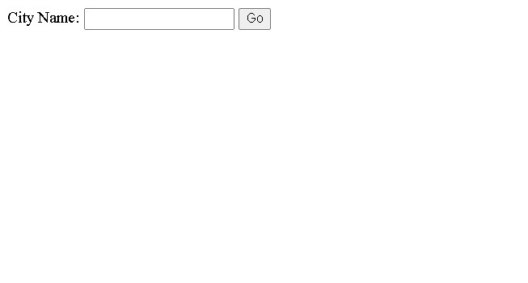
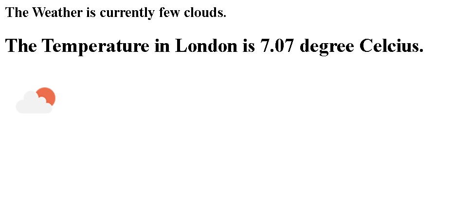

# WeatherApp 🌦️

This is a small project that is created using
1. OpenWeatherApi
2. Javascript

The modules that has been used in this project are: Express, HTTPS, Body Parser, Nodemon

# 🕹️To install the above module, run the below command in the terminal
### ⚡The Command: npm i express nodemon body-parser
 

## ➡️After successful run of project, it will ask the city name as shown below:

## ➡️Then after entering the GO button it will then show the output which is also shown below:

